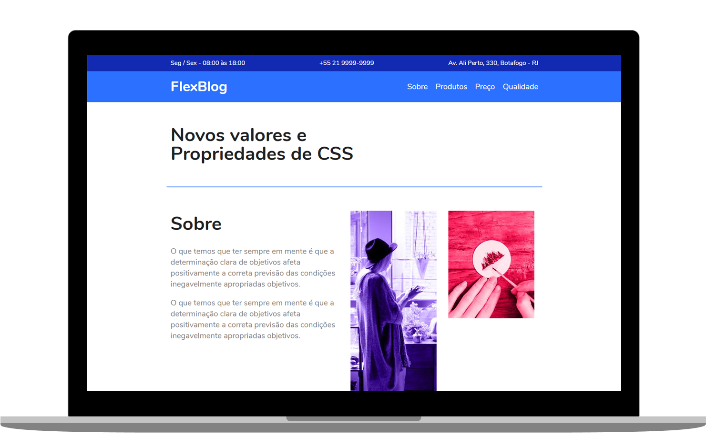

<h1 align="center">
  FLEXBLOG
</h1>

   
  
  
  

  

  

## ◾ Projeto

O FlexBlog é um projeto feito totalmente com CSS FlexBox. O intuito era treinar todas as tecnicas de posicionamente com FlexBox

#### Visitar o site: [FlexBlog.com](https://www.origamid.com/projetos/flexblog/)

## ◾ Tecnologias

Esse projeto foi desenvolvido com as seguintes tecnologias:

- [HTML](https://developer.mozilla.org/pt-BR/docs/Web/HTML)
- [CSS](https://developer.mozilla.org/pt-BR/docs/Web/CSS)

## ◾ Licença

Esse projeto está sob a licença MIT.
